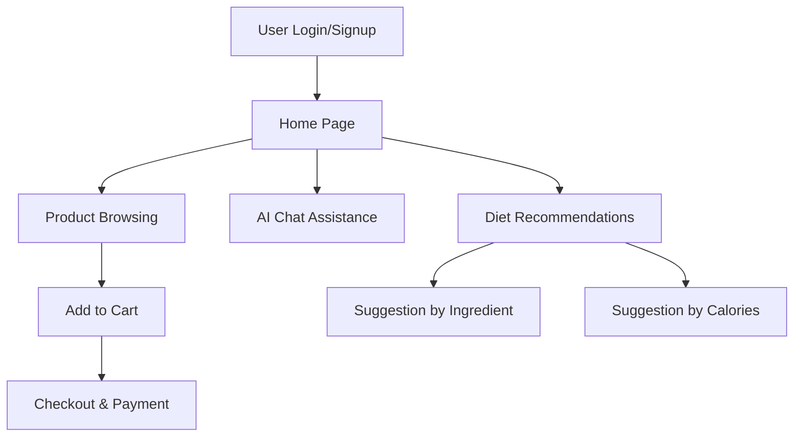

# DietFit

DietFit is a comprehensive web application designed to help users manage their fitness journey through personalized diet plans, BMI calculations, gym product purchases, and AI-powered chat assistance. The project utilizes Django for the backend, integrating with React on the frontend to provide a smooth and user-friendly experience.
## Video

Watch the demo video to see how **DietFit** works.

[DietFit](https://github.com/user-attachments/assets/b20e5dae-eeac-445c-a512-020cf5ea4eaa
)

## Project Structure

```
DietFit/
├── backend/
│   ├── models.py          # Defines database models for user, cart, and purchases
│   ├── views.py           # Implements API endpoints for login, signup, chat, and product purchasing
│   ├── urls.py            # Configures URL routing for backend services
│   └── serializers.py     # Serializes model data for API responses
│
├── frontend/
│   ├── App.js             # Main entry point for frontend with routing setup
│   ├── components/
│   │   ├── Home.js        # Home page component
│   │   ├── Product.js     # Product listing and purchase component
│   │   ├── product/
│   │       ├── Login.js   # Login page
│   │       ├── Signup.js  # Signup page
│   │       ├── About.js   # About page
│   │       ├── Cart.js    # Shopping cart component
│   │       ├── Chatwithus.js  # Chatbot interface
│   │       └── chatbox.js     # Chatbox for AI-based diet suggestions
│
└── README.md              # Documentation for project overview and usage
```

## Application Flow

1. **User Authentication**: 
   - Users can sign up or log in using their credentials. Upon successful login, they are directed to the home page.

2. **Home Page**:
   - Users are introduced to available gym products, diet recommendations, and BMI calculation tools.

3. **Product Purchases**:
   - Users can browse various gym-related products such as protein bars, fruits, and shakes. Each product can be added to the cart and checked out through the purchasing API.

4. **AI Chat Assistance**:
   - Users can interact with an AI-powered chatbot (Chatwithus) for personalized diet suggestions based on goals like weight loss or weight gain. The chatbot generates a 1-week diet plan and helps users with their fitness inquiries.

5. **Diet Recommendations**:
   - The app offers diet suggestions based on user-input ingredients or specific caloric needs.

6. **Shopping Cart**:
   - The cart allows users to view and manage selected products and proceed to checkout.

## Flowchart

Below is a visual representation of the application flow:



## Visualization and UI

DietFit includes a user-friendly UI for easy navigation and interaction. Here are some screenshots showing different sections of the application:

### Registration Page


### Home Page


### Product Listing


### Diet Plan


### Shopping Cart


### Product Details


### Order Summary


## Technologies Used

- Backend: Django REST Framework for creating API endpoints
- Frontend: React for component-based structure and routing
- Database: SQLite (default) for development; other databases can be configured for production
- AI Integration: GEMINI AI for personalized diet recommendations

## Getting Started

1. Clone the repository:
   ```bash
   https://github.com/ayush22122004/DietFit.git
   ```
   
2. **Backend Setup**:
   - Navigate to the backend folder and install dependencies.
   - Run migrations and start the Django server:
     ```bash
     cd backend
     python manage.py migrate
     python manage.py runserver
     ```

3. **Frontend Setup**:
   - In a new terminal, navigate to the frontend folder, install dependencies, and start the React app:
     ```bash
     cd frontend
     npm install
     npm start
     ```

## Contributing

I welcome contributions! If you find bugs, want to add features, or have suggestions, please feel free to submit a pull request or create an issue.
